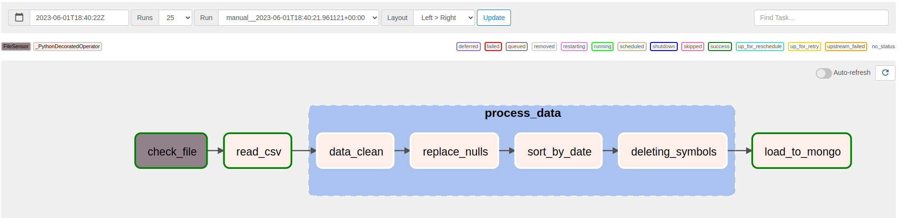
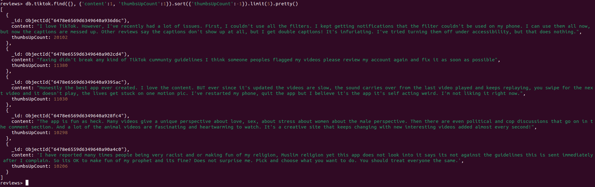
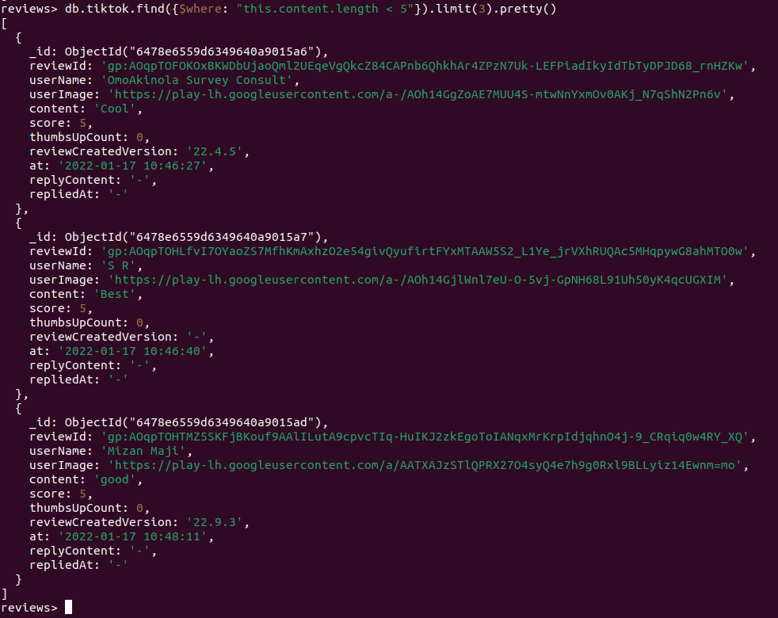
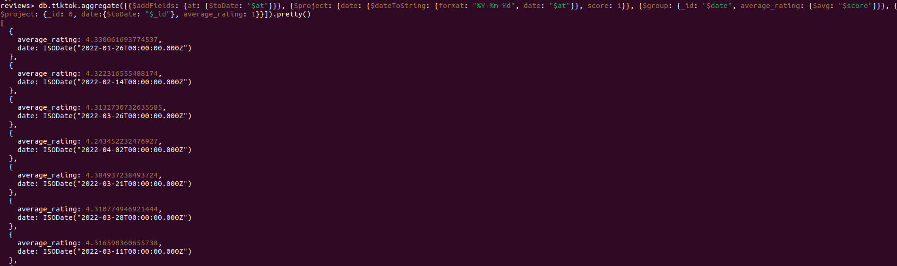

# Airflow

## Info
All was installed locally: Airflow with database PostgreSQL, MongoDB and surprisingly Python.

## Results
Visualization of DAG:



## Queries

- 1.Top 5 popular comments:
```shell
db.tiktok.find({}, {'content':1, 'thumbsUpCount':1}).sort({'thumbsUpCount':-1}).limit(5)
```


- 2.All docs where length of field "content" less then 5:
```shell
db.tiktok.find({$where: "this.content.length < 5"})
```


- 3.The avarange score per every day. Result in timestamp type:
```shell
db.tiktok.aggregate([{$addFields: {at: {$toDate: "$at"}}}, {$project: {date: {$dateToString: {format: "%Y-%m-%d", date: "$at"}}, score: 1}}, {$group: {_id: "$date", average_rating: {$avg: "$score"}}}, {$project: {_id: 0, date:{$toDate: "$_id"}, average_rating: 1}}]).pretty()
```


